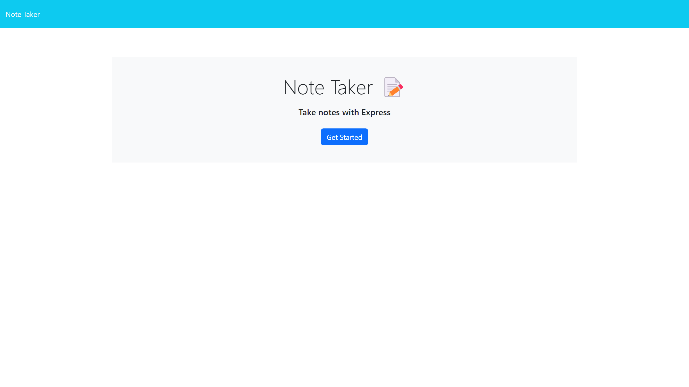

# Jakebs Note Taker
A note taking web application.

## About this repository
This repository aims to allow a user to take notes and store them in a server-side API for easy access and remote use.

## Project Aims
* **When the user opens the application they are presented with a landing page that links to the note taker.**
* **When the user opens the notes page they are presented with existing notes in the left column and empty fields to enter a new note on the right column.**
* **When the user enters a title and text the user is presented with a save note and clear form button in the top right.**
* **When the user clicks the save button the note is saved to the left hand column, a new note button appears in the top right and the user is able to select between the notes to open them.**
* **When the user clicks on the new note button they are presented with an empty form for recording notes once again.**

## Technologies
This project uses Node.js, express.js and npm as the primary technologies.
These are the npm packages used:
* **fs** - For reading and writing to file.
* **uuid** - For generating unique identifiers for each note stored.
* **express** - For all API and server functionality.

## How to use
* **This application requires the user to have both npm and Node.js installed on their computer without these the application will not work.**
1. Open the application in your browser.
2. Click  the 'Get Started' button.
3. Write a note that you want to save and click the 'Save Note' button in the top right.
4. You can click through existing notes on the left to open their content, or the bin icon to delete them.
5. Click the 'New Note' button when you're ready to write a new note!

## Challenges
This project was relatively smooth for development, however I did get caught when creating my route methods for the API the problem was that I was declaring the wildcard route at the start of my server.js file instead of AFTER all of the other routes. It took me quite a long time to trouble shoot that one, once I found the issue though I did distinctly remember being warned about that by my instructor when I was initially taught about the wildcard route.

Below is a screenshot of the deployed web application:

## Deployed Application
The deployed application can be found [here](https://jakebs-note-taker-5299d0b695d4.herokuapp.com).

